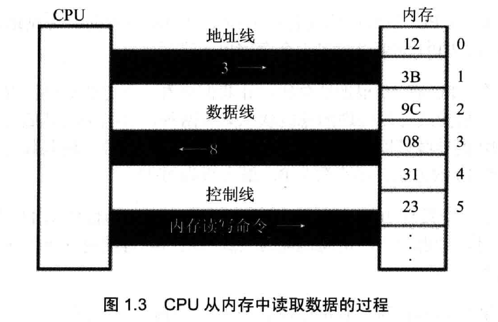

## 1、基础知识

### 机器语言

1、机器语言是机器指令的集合。机器指令展开来讲就是一台机器可以正确执行的命令。电子计算机的机器指令是一列二进制数字。

2、汇编语言的主体是汇编指令。汇编指令和机器指令的差别在于指令的表示方法上。汇编指令是机器指令便于记忆的书写格式。

3、寄存器，简单讲是 CPU 中可以存储数据的器件，一个 CPU 中有多个寄存器。

4、汇编语言写出源程序，再用汇编编译器将其编译成机器码，由计算机最终执行。

### 汇编语言的组成

1、汇编有 3 类指令组成：

* 汇编指令：机器码的助记符，有对应的机器码

* 伪指令：没有对应的机器码，由编译器执行，计算机并不执行。

* 其他符合：如+、-、*、/ 等，由编译器识别，没有对应的机器码。

### 存储器

1、CPU 是计算机的核心部件，它控制整个计算机的运作并进行运算。要让一个 CPU 工作，就必须向它提供指令和数据。指令和数据在存储中存放，也就是我们平时说的内存。

### 指令和数据

1、指令和数据是应用上的概念。在内存或磁盘上，指令和数据没有任何区别，都是二进制信息。CPU 在工作的时候把有的信息看作指令，有的信息看作数据。

```c
1000100111011000 // 可以看作大小为 89D8H 的数据来处理，也可以看作指令 mov ax, bx 来执行
```

```c
1000100111011000 -> 89D8H (数据)
1000100111011000 -> mov ax, bx (程序)
```

### 存储单元

1、存储器被划分为若干个存储单元，每个单元从 0 开始顺序编号。

2、最小的信息单位是 bit，一个二进制位。8 个 bit 组成一个 Byte，也就是一个字节。

3、微型机存储器的存储单元可以存储一个 Byte，即 8 个二进制位。一个存储器有 128 个存储单元，可以存储 128 个 Byte。

4、微机存储器的容量是以字节为最小单位来计算的。对于拥有 128 个存储单元的存储器，他的容量是 128 个字节。

5、单位（B 代表 Byte）

* 1KB = 1024B
* 1MB = 1024KB
* 1GB = 1024MB
* 1TB = 1024GB

### CPU 对存储器的读写

1、存储器被划分成多个存储单元，存储单元从零开始顺序编号。这些编号可以看作存储单元在存储器中的地址。

2、CPU 要从内存中读取数据，首先要指定存储单元的地址。

3、CPU 要想进行数据的读写，必须和外部器件（标准说法是芯片）进行 3 类信息的交互：

* 存储单元的地址（地址信息）；
* 器件的选择，读或写的命令（控制信息）；
* 读或写的数据（数据信息）；

4、计算机中专门有连接 CPU 和其它芯片的导线，通常称为总线。总线就是一根根导线的集合。

5、根据传送数据的不同，总线从逻辑上又分为 3 类：地址总线、控制总线和数据总线。



* CPU 通过地址线将地址信息 3 发出。
* CPU 通过控制线发出内存读命令，选中存储器芯片，并通知它，将要从中读取数据。
* 存储器将 3 号单元的数据 8 通过数据线送入CPU。

### 地址总线

1、CPU 是通过地址总线来指定存储器单元的。

2、一个 CPU 有 N 根地址线，则可以说这个 CPU 的地址总线的宽度为 N。这样的 CPU 最多可以寻找 2 的 N 次方个内存单元。

### 数据总线

1、CPU 与内存或其他器件之间的数据传递是通过数据总线来进行的。数据总线的宽度决定了 CPU 和外界的数据传送速度。

### 控制总线

CPU 对外部器件的控制是通过控制总线来进行的。控制总线是个总称，控制总线是一些不同控制线的集合。

## 寄存器

一个典型的 CPU 由运算器、控制器、寄存器等器件构成，这些器件靠内部总线相连。

在 CPU 中：

* 运算器进行信息处理；
* 寄存器进行信息存储；
* 控制器控制各种器件进行工作；
* 内部总线连接各种器件，在它们之间进行数据的传送；

### 字在寄存器中的存储

处于对兼容性的考虑，8086 CPU 可以一次性处理以下两种尺寸数据：

* 字节：byte，一个字节由 8 个 bit 组成，可以存在 8 位寄存器中。
* 字：word，一个字由两个字节组成，这两个字节分别称为这个字的高位字节和低位字节。


### 汇编指令


* 汇编指令或寄存器名称不区分大小写
* al 作为一个独立的 8 位寄存器使用时，和 ah 没有关系，CPU 在执行时认为 ah 和 al 是两个不相关的寄存器。
* 在进行数据传送或运算时，要注意指令的两个操作数的位数应当是一致的。

### 物理地址

1、CPU 访问内存单元时，要给出内存单元的地址。所有的内存单元构成的存储空间是一个一维的线性空间，每一个内存单元在这个空间中都有唯一的地址，这个唯一的地址称为**物理地址**。

2、CPU 通过地址总线送入存储器的，必须是一个内存单元的物理地址。

### 16 位结构 CPU

1、16 位结构的 CPU 具有几个方面的特性：

* 运算器一次最多可以处理 16 位的数据；
* 寄存器的最大宽度为 16 位；
* 寄存器和运算器之间的通路为 16 位。

### 8086 给出物理地址的方法

1、8086 CPU 采用一种在内部用两个 16 位地址合成的方法来形成一个 20 位的物理地址。


当 8086 CPU 要读写内存时：

1. CPU 中的相关部件提供两个 16 位的地址，一个称为段地址，另一个称为偏移地址；
2. 段地址和偏移地址通过内部总线送入一个称为地址加法器的部件；
3. 地址加法器将两个 16 位地址合成为一个 20 位的物理地址；
4. 地址加法器通过内部总线将 20 位物理地址送入输入输出的控制电路；
5. 输入输出控制电路将 20 位物理地址送上地址总线；
6. 20 位物理地址被地址总线传送到存储器。

2、地址加法器：**物理地址=段地址*16+偏移地址**

### "段地址"*16+偏移地址=物理地址”的本质含义

CPU 在访问内存时，用一个基础地址（段地址*16）和一个相对于基础地址的偏移地址相加，给出内存单元的物理地址。

### 断的概念

1、内存并没有分段，段的划分来自于 CPU。可以用分段的方式来管理内存。

2、可以根据需要，将若干地址连续的内存单元看作一个段，用段地址 * 16 定位段的起始地址（基础地址），用偏移地址定位段中的内存单元。

* CPU 可以用不同的段地址和偏移地址形成同一个物理地址。
* 偏移地址 16 位，变化范围为 0~FFFFH，仅用偏移地址来寻址最多可寻 64 KB 个内存单元。

### CS 和 IP

1、CS 和 IP 指示了 CPU 当前要读取指令的地址，CS 为代码段寄存器，IP 为指令寄存器


1. 从 CS:IP指向的内存单元读取指令，读取的指令进入指令缓冲器；
2. IP=IP+所读取指令的长度，从而指向下一条指令；
3. 执行指令。转到步骤（1），重复这个工程。

2、CPU 将 CS:IP 指向的内存单元中的内容看作指令，CPU 将 CS、IP 中的内容当做指令的段地址和偏移地址，用它们合成指令的物理地址，到内存中读取指令码，执行。


